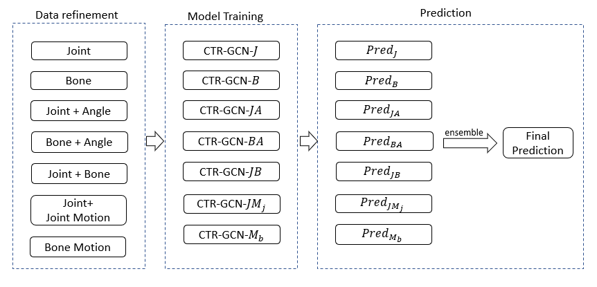

# 2021 CCF BDCI基于飞桨实现花样滑冰选手骨骼点动作识别-第3名方案

## 模型构建思路与调优过程

由于骨骼关键点的序列数据天然具有时空图的结构，适用于作为图神经网络的输入，目前主流的基于骨骼关键点的动作识别算法大多基于图神经网络。相较于基于CNN与RNN的模型，图神经网络能够在较少的参数量下取得较高的识别精度。本次比赛中，我们的模型使用目前最优的骨骼关键点识别模型CTR-GCN[1]作为backbone，并使用带Label Smoothing的多分类Focal loss[2]作为损失函数，提升模型对困难样本的区分能力。在数据处理阶段，我们使用上采样策略缓解类别不均衡问题，利用分段随机采样的方法处理序列长度不均衡的问题，并引入了骨骼向量、骨骼角度、以及运动速度等多种特征特征训练模型，提升模型的准确率与鲁棒性。模型的框图如图1所示。

<div align="center">
  
  <br>图1 算法流程</br>
</div>

## 目录结构

```text
├── aistudio_project.ipynb
├── data
│   ├── test_A_data.npy
│   ├── test_B_data.npy
│   ├── train_data.npy
│   └── train_label.npy
└── work
    ├── dataset
    │   ├── generate_feature.py
    │   ├── generate_index.py
    │   └── index
    ├── doc
    └── PaddleVideo
        ├── configs
        ├── ensemble.py
        ├── LICENSE
        ├── logits
        ├── main.py
        ├── model_ours
        ├── paddlevideo
        ├── README_cn.md
        ├── README.md
        ├── requirements.txt
        ├── run_test.sh
        └── run_train.sh
```

## 目录与文件描述

|目录/文件名|描述|
|---|---|
|aistudio_project.ipynb|AIStudio 项目的Notebook，包含项目介绍与运行方式|
|data|data目录用于存放数据集，需自行下载数据后按目录结构进行组织|
|work/dataset/generate_feature.py| 数据预处理脚本，用于特征抽取 |
|work/dataset/generate_index.py| 数据预处理脚本，用于划分验证集|
|work/dataset/index|该目录下存储指示验证集的划分方式的npy文件|
|work/PaddleVideo/configs| 该目录下存储模型的yaml配置文件|
|work/PaddleVideo/ensenmble.py|融合模型预测结果的脚本|
|work/PaddleVideo/logits|该目录用于存放模型的预测结果|
|work/PaddleVideo/model_ours|该目录下存放训练完毕的模型，用于复现B榜成绩|
|work/PaddleVideo/requirements.txt|依赖配置文件|
|work/PaddleVideo/run_test.sh|模型预测脚本，用于复现B榜成绩|
|work/PaddleVideo/run_train.sh|模型训练脚本|

## 环境配置
```bash
cd ~/work/PaddleVideo/
python3.7 -m pip install --upgrade pip
python3.7 -m pip install --upgrade -r requirements.txt
```

## 数据预处理
数据预处理由三部分组成：五折交叉验证集的生成、特征提取与训练数据上采样。

### 1. 五折交叉验证
由于本数据集未给出验证集，所以我们按照训练集和验证集8:2的比例对数据集进行了的五折划分，通过`~/work/dataset/generate_index.py`生成各个fold的训练和验证集的index。我们生成的index在`~/work/dataset/index/`中已经给出，不需要重新生成。

### 2. 特征提取
由于数据集本身的信息量较小，不能使模型得到很好地训练，对此我们根据原始数据生成了7种不同的特征，包括J,JA,JMj,B,BA,JB,Mb，其中J代表关节点(Joints)，B代表关节向量(Bone)，A代表关节之间的角度(Angle)，Mj代表J的运动向量(Joints Motion)，Mb代表B的运动向量(Bone Motion)。

### 3. 数据上采样
我们统计了数据集中所有类别对应的样本数目，发现类别之间存在样本数量不均衡问题(最多相差6.7倍)，这会导致样本数量较少的类别无法得到充分的学习。对此我们使用Upsampling，对我们划分好的训练集进行上采样，使每个类别的样本数目保持一致。验证集和测试集不需要Upsampling。

### 数据预处理命令汇总

我们将以上数据预处理步骤统一整合至generate_feature.py文件中，生成数据时只需调用该python脚本即可。

注意事项
- 通过`-m`参数指定生成数据类型（train/valid/test），默认生成测试集的数据。
- 生成的数据将分别保存在`~/work/dataset/train/`、`~/work/dataset/valid/`和`~/work/dataset/test/`中
- 训练集部分的数据生成花费时间较长且占用内存较多（需至少xGB的内存才可正常运行，耗时约x分钟）。我们已经提供了训练完毕的模型参数，如需复现B的结果，只需生成test部分的数据

```bash
cd ~/work/dataset/
# generate train data
python3.7 generate_feature.py -m train

# generate validation data
python3.7 generate_feature.py -m valid

# generate test data
python3.7 generate_feature.py -m test
```

## 训练脚本
按照上述步骤进行数据生成后，可使用本模块描述的训练脚本进行模型训练。

### 单一模型训练启动命令
使用以下脚本可以完成单一模型的训练。

注意事项：
- 通过`-c`参数指定配置文件。训练完毕后，验证集上准确率最高的模型将保存在`~/work/model/`路径下。比赛中我们使用的全部模型的yaml配置文件均已存放在./configs/recognition/ctrgcn目录下。

```bash
cd ~/work/PaddleVideo/
python3.7 main.py -c $PATH_TO_YOUR_CONFIGURATIOM_YAML --validate
# 运行示例: python3.7 main.py -c configs/recognition/ctrgcn/ctrgcn_fsd_J_fold0.yaml --validate
```

### 集成模型训练启动命令
由于本队的最终模型由一系列模型的集成得到，手动配置yaml文件训练逐一模型需要耗费大量的精力。这里我们将本队使用的全部模型的训练命令整合至run_train.sh文件下，如需完整复现，只需运行以下命令，无需手动配置yaml文件。

注意事项：
- 需要注意的是，由于模型数量较多，该命令的运行需要耗费较长时间（约2.5h * 35 = 87.5h) 

```bash
cd ~/work/PaddleVideo/
sh run_train.sh
```

## 测试脚本
模型训练完成后，可使用本节所描述的测试脚本进行评估。

### 单一模型测试启动命令
使用以下命令可以完成单一模型在相应测试集上的推理，推理结果将保存在`~/work/PaddleVideo/submission.csv`文件中。

注意事项：
- 通过`-c`参数指定配置文件，通过`-w`指定权重存放路径进行模型测试。

```bash
cd ~/work/PaddleVideo/
python3.7 main.py --test -c $PATH_TO_YOUR_CONFIGURATIOM_YAML -w $PAHT_TO_YOUR_PDPARAMS_FILE
```


### 集成模型测试启动命令

由于完整的模型测试需要综合35个模型进行集成，配置较为复杂，这里我们将35个模型的推理与集成命令整合至run_test.sh文件中，如需复现结果只需运行如下命令即可。得到的评估结果保存在`~/work/PaddleVideo/submission_ensemble.csv`文件中。

注意事项:
- 如需在您训练得到的模型上进行测试，您需要修改run_test.sh文件中配置的模型文件路径

```bash
cd ~/work/PaddleVideo/
sh run_test.sh
```

